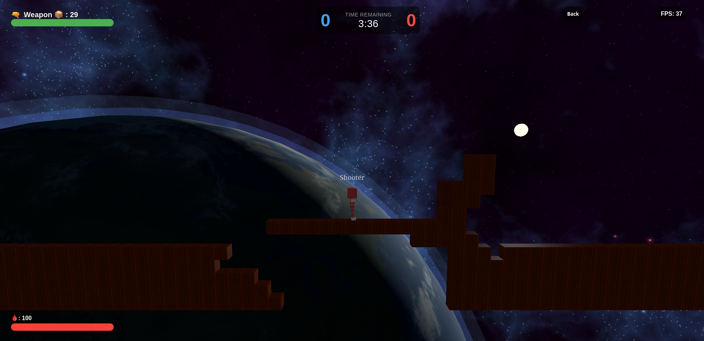

# Facing Worlds

> A 2.5D multiplayer block-based shooter

Up to 8 players join a shared room made entirely of destructible blocks. Place them, blow them up,
use them as cover; all while hunting down the other team. The team with the fewest deaths wins at the end of the round.

### [Play it live here →](https://facing-worlds.netlify.app/) 
Connect to a public server by using this URL (might take up to a minute if the server hasn't been in use): https://facing-worlds.onrender.com/

---

## Getting Started

### Prerequisites
- [Node.js](https://nodejs.org) installed on your machine

### Installation

1. Open a terminal in the root of the project
2. Install dependencies: npm install
3. Start the server: npm start
4. Open your browser and navigate to the local address shown in the terminal

## Multiplayer

### Local network (same Wi-Fi)
Find your local IP address and share it with other players on the same network they can connect directly without any extra setup.

### Over the internet
1. Check the port number displayed in your server console
2. Forward that port in your router settings
3. Share your public IP address with other players they connect using `your-ip:port`
